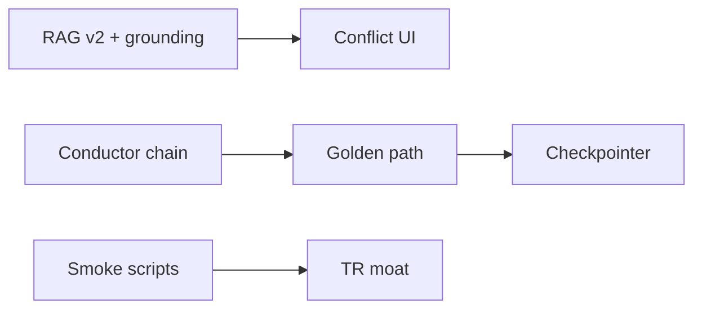

# Differentiation Sprint Plan — RAG v2 · Conflict UI · Golden Path · TR Moat

> **Horizon:** 6 hafta (3 sprint × 2 hafta)  
> **Law:** `AGENTIC_RAG_ENGINEERING.md` + `CLAUDE.md` — verifier, depth follows data, queue separation  
> **Done =** `./scripts/proof.sh --fast` + sprint-specific `./scripts/golden-path-check.sh`

---

## Hedef (4 sütun)

| # | Sütun | Kullanıcı vaadi | Teknik çıktı |
|---|--------|-----------------|--------------|
| 1 | **RAG v2 + grounding** | “Cevap kanıtlı, sayı uydurulmuyor” | pgvector + hybrid retriever + grounding validator |
| 2 | **Conflict + negotiation UI** | “CFO ile CMO çelişince görürüm” | Consensus auto-run + Command Center kartı |
| 3 | **Golden path (60s board deck)** | “Upload → 6 lens → board deck” | Orchestrated demo script + E2E smoke |
| 4 | **TR muhasebe hattı** | “Paraşüt → analiz → SMMM paketi” | Sync → canonical → CFO → export |

---

## Sprint 1 (Hafta 1–2) — Foundation + doğrulama

### 1A — RAG v2 temeli
- [ ] Migration `023_rag_embeddings.py` — `rag_chunks.embedding vector(1536)` nullable + HNSW index (pgvector)
- [ ] `EmbeddingRagRetriever` — OpenAI-compatible embeddings, TF-IDF fallback
- [ ] Worker: index job sonrası embedding yaz
- [ ] `grounding_validator.py` — citation yoksa factual claim flag
- [ ] Chat: `evidence_found=false` → hard disclaimer

**DoD:** `pytest test_rag_*` geçer; staging’de `/chat/agent` citation döner.

### 1B — Conductor → auto_chain
- [x] `ManagementConductor` plan before downstream enqueue
- [ ] Log conductor plan to `result_metadata.conductor_plan`
- [ ] Skip chained agents when conductor says `should_run=false`

**DoD:** CFO complete log’unda conductor plan görünür.

### 1C — Golden path smoke (yapısal)
- [x] `scripts/golden-path-check.sh` — bileşen varlık kontrolü
- [ ] `scripts/golden-path-e2e.sh` — upload → poll → CEO deck (staging)

**DoD:** `./scripts/golden-path-check.sh` exit 0.

---

## Sprint 2 (Hafta 3–4) — Conflict UI + board deck polish

### 2A — Conflict pipeline
- [ ] CFO + risk complete → auto `ConsensusEngine.run_consensus` (cash_risk, revenue_outlook)
- [ ] `GET /system/ops` → `management.conflicts` özeti
- [ ] Command Center: **Conflict Card** (severity, agents, recommended action)
- [ ] Frontend: `useConflicts` hook + negotiation API client

**DoD:** İki zıt sinyalli fixture ile conflict kartı render.

### 2B — Board deck golden path
- [ ] `POST /ceo/analyze-async` auto-chain after CFO (mevcut) — SLA < 120s P95 staging
- [ ] Command Center CTA: “Generate board deck”
- [ ] PDF export via `board_deck_pdf.py` smoke test

**DoD:** Demo org’da upload → deck slides JSON dolu.

---

## Sprint 3 (Hafta 5–6) — TR moat + production hardening

### 3A — Paraşüt → SMMM
- [ ] `scheduled_sync` → canonical → quality gate → CFO enqueue (mevcut hattı sıkılaştır)
- [ ] SMMM onay paketi: failed/awaiting_review + canonical summary
- [ ] e-Fatura / GIB sandbox connector smoke

**DoD:** Paraşüt sandbox sync → canonical row → analysis job idempotent.

### 3B — Observability
- [ ] LangGraph checkpointer (SQLite dev / Postgres prod) — resume failed jobs
- [ ] LLM cost metrics in `/system/ops`
- [ ] Load baseline: `./scripts/load-baseline.sh` CI artifact

---

## Doğrulama matrisi (her sprint sonu)

```bash
# Zorunlu kapı
./scripts/proof.sh --fast

# Sprint 1+
./scripts/golden-path-check.sh

# Staging (BACKEND_URL set)
BACKEND_URL=http://localhost:8000 ./scripts/staging-smoke.sh

# Agent tests
pytest backend/tests/test_agents/test_platform_engineering.py -q
pytest backend/tests/test_agents/test_rag_grounding.py -q   # Sprint 1
pytest backend/tests/test_agents/ -q --ignore=tests/test_parsers
```

---

## Mimariyi bozmayan kurallar

1. Yeni RAG → sadece `RagRetriever` implementasyonu; API imzası sabit  
2. Conflict → mevcut `ConsensusEngine` + `negotiation` API; yeni silo yok  
3. Golden path → mevcut CFO + CEO orchestrator; yeni pipeline yok  
4. TR hattı → canonical + sync_runs; raw SQL yok  
5. Her agent run → JobLog / StepLog + verifier where applicable  

---

## Bağımlılık sırası



---

## Riskler

| Risk | Mitigation |
|------|------------|
| pgvector prod’da yok | Embedding nullable; TF-IDF fallback kalır |
| Conflict false positive | CONFLICT_THRESHOLD tune + human resolve UI |
| Golden path timeout | maintenance queue isolation (done) |
| LLM cost spike | llm_router task routing + cache |

---

*Owner: platform team · Branch: `feat/platform-scalability-v1` · Updated: 2026-08-19*
