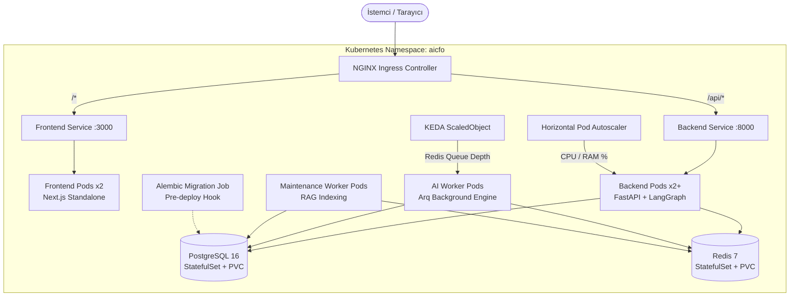

# ☸️ Agentic CFO — Kubernetes & Cloud-Native Mimari Rehberi

Bu rehber, **Agentic CFO** kurumsal yapay zeka platformunun Kubernetes kümesi üzerinde üretime hazır (production-grade) ve yüksek erişilebilir (HA) bir şekilde çalıştırılması için gerekli tüm bilgileri içerir.

---

## 🏛️ Mimari Şeması



---

## 📂 Dizin Yapısı

```
agentic-cfo/
├── k8s/                           # Saf Kubernetes Manifestleri (Kustomize Uyumlu)
│   ├── 00-namespace.yaml          # aicfo izole isim alanı
│   ├── 01-config.yaml             # ConfigMap (Ortam değişkenleri)
│   ├── 02-secrets.yaml            # Secret (Hassas şifreler / API Keyler)
│   ├── 05-migration-job.yaml      # Alembic DB Migration Job
│   ├── 10-postgres.yaml           # PostgreSQL StatefulSet + PVC + Service
│   ├── 11-redis.yaml              # Redis StatefulSet + PVC + Service
│   ├── 20-backend.yaml            # Backend Deployment + Service + Probes + Limits
│   ├── 21-worker.yaml             # AI Analysis Worker Deployment
│   ├── 22-worker-maintenance.yaml # RAG & Maintenance Worker Deployment
│   ├── 23-hpa-backend.yaml        # Backend HPA (CPU/RAM Autoscaling)
│   ├── 24-keda-worker.yaml        # KEDA Event-driven Queue Autoscaler
│   ├── 30-frontend.yaml           # Next.js Frontend Deployment + Service
│   ├── 40-ingress.yaml            # NGINX Ingress Routing
│   ├── 50-networkpolicy.yaml      # Zero-Trust Ağ İzolasyonu
│   └── kustomization.yaml         # Kustomize orkestrasyonu
│
├── helm/agentic-cfo/              # Üretim Seviyesi Helm Paketi
│   ├── Chart.yaml                 # Paket meta bilgileri
│   ├── values.yaml                # Varsayılan / Prodüksiyon ayarları
│   ├── values-dev.yaml            # Yerel geliştirme / Minikube ayarları
│   └── templates/                 # Parametrik K8s şablonları
│
├── .github/workflows/
│   └── k8s-deploy.yml             # GitHub Actions CI/CD Dağıtım Hattı
│
└── scripts/
    ├── k8s-deploy.sh              # Linux / macOS tek tıkla kurulum
    └── k8s-deploy.ps1             # Windows PowerShell tek tıkla kurulum
```

---

## ⚡ Hızlı Başlangıç (Quick Start)

### 1. Yerel Kubernetes (Minikube / Docker Desktop / Kind)

#### Windows (PowerShell):
```powershell
.\scripts\k8s-deploy.ps1
```

#### Linux / macOS:
```bash
chmod +x ./scripts/k8s-deploy.sh
./scripts/k8s-deploy.sh
```

#### Manuel (Kustomize):
```bash
kubectl apply -k k8s/
```

---

## 📦 Helm ile Dağıtım (Production)

### Geliştirme Ortamı (Dev):
```bash
helm upgrade --install aicfo ./helm/agentic-cfo \
  --namespace aicfo \
  --create-namespace \
  -f ./helm/agentic-cfo/values-dev.yaml
```

### Canlı Ortam (Production):
```bash
helm upgrade --install aicfo ./helm/agentic-cfo \
  --namespace aicfo \
  --create-namespace \
  -f ./helm/agentic-cfo/values.yaml
```

---

## 🤖 Agentic Sistemler İçin Özel Yetenekler

### 1. Kuyruk Tabanlı Ölçeklenme (KEDA)
`k8s/24-keda-worker.yaml` dosyası Redis kuyruğundaki bekleyen görev sayısını (`arq:queue:analysis`) dinler. Kuyrukta bekleyen iş sayısı 5'i geçtiğinde worker sayısını dinamik olarak 15'e kadar çıkarır.

### 2. Güvenli Veritabanı Migrasyonları (Job)
`05-migration-job.yaml` backend ayağa kalkmadan önce `alembic upgrade head` komutunu çalıştırarak veritabanı şemasını otomatik günceller.

### 3. Sıfır Kesinti (Zero-Downtime Deployment)
Backend ve Frontend pod'larında tanımlanan `readinessProbe` ve `livenessProbe` sayesinde yeni bir sürüm çıktığınızda eski pod'lar yenisi tam hazır olana kadar trafiği kesmez.

### 4. Zero-Trust Ağ İzolasyonu (NetworkPolicy)
`50-networkpolicy.yaml` sayesinde Frontend pod'larının doğrudan PostgreSQL'e erişmesi engellenir. Yalnızca Backend API pod'ları veritabanına bağlanabilir.
